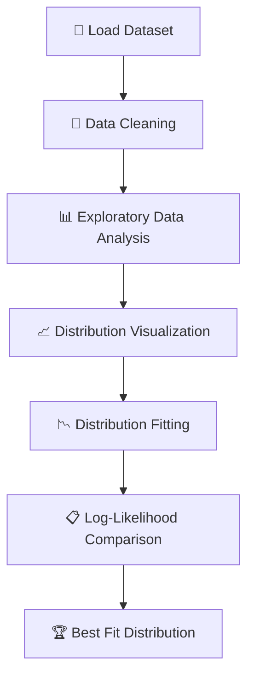

<div align="center">

# 📊 Statistical Distribution Analysis Model

### *From Statistical Theory to Practical Distribution Modeling using Python*

<p align="center">


</p>

---

### 📖 Learn • 📊 Analyze • 📈 Visualize • 📉 Compare

A complete project that explains the **fundamentals of Statistical Distributions** and demonstrates their practical implementation through **Python, Statistical Modeling, Distribution Fitting, and Data Visualization**.

<br>

<a href="YOUR_DEMO_LINK">

</a>

<a href="https://github.com/jeelprajapati0606/spread_locator/blob/main/Spread%20Locator/Statistical_Distribution_Analysis_model-checkpoint.ipynb">

</a>

<a href="https://github.com/jeelprajapati0606/spread_locator/blob/main/Spread%20Locator/Part%20A%20-%20Theoretical%20Foundation.pdf">

</a>

<a href="https://github.com/jeelprajapati0606/spread_locator/blob/main/Spread%20Locator/Speed_Locator_Data.csv">

</a>

</div>

---

# 🌟 Overview

> **Statistical Distribution Analysis Model** is a complete learning project designed to bridge the gap between **statistical theory** and **real-world implementation**.

The project is divided into **two major sections**:

| 📚 Section | Description |
|------------|-------------|
| 📖 Theory | Covers the complete statistical concepts including probability distributions, Q-Q Plot, Bernoulli, Binomial, Log-Normal, Power Law, Poisson Distribution, Box-Cox Transformation, Z-Score, PDF vs CDF, and their real-world applications. |
| 💻 Practical | Demonstrates statistical distribution analysis using Python on a real dataset, including exploratory data analysis, visualization, model fitting, and likelihood comparison. |

---

# ✨ Project Highlights

<table>
<tr>

<td width="33%" align="center">

### 📖 Theory

Complete explanation of statistical distributions with formulas, graphs, examples, and Python concepts.

</td>

<td width="33%" align="center">

### 💻 Practical

Hands-on implementation using Python, Pandas, NumPy, SciPy, and Matplotlib.

</td>

<td width="33%" align="center">

### 📈 Analysis

Visualize data, fit statistical distributions, compare likelihoods, and identify the best model.

</td>

</tr>
</table>

---

# 🚀 Key Features

| Feature | Status |
|----------|:------:|
| 📖 Complete Theory Notes | ✅ |
| 📊 Statistical Distribution Analysis | ✅ |
| 📈 Distribution Visualization | ✅ |
| 📉 Distribution Fitting | ✅ |
| 📋 Log-Likelihood Comparison | ✅ |
| 📦 Real Dataset | ✅ |
| 🐍 Python Implementation | ✅ |
| 📚 Beginner Friendly | ✅ |
| 💼 Portfolio Ready Project | ✅ |

---

# 📑 Table of Contents

- 🌟 Overview
- ✨ Key Features
- 📂 Dataset
- 📖 Theory Notes
- 📊 Workflow
- 💻 Practical Implementation
- 👨‍💻 Author

---

# 📂 Dataset Information

This project uses a **Speed Locator Dataset** to analyze statistical distributions and identify the best-fitting probability model.

---

## 📌 Dataset Overview

| Property | Details |
|:---------|:--------|
| 📄 Dataset Name | `Speed_Locator_Data.csv` |
| 📊 Dataset Type | CSV (Comma Separated Values) |
| 📈 Data Category | Continuous Numerical Data |
| 🎯 Analysis Target | `transaction_amount` |
| 💻 Language Used | Python |
| 📚 Libraries | Pandas, NumPy, SciPy, Matplotlib |

---

## 📋 Dataset Columns

| # | Column Name | Data Type | Description |
|:-:|-------------|-----------|-------------|
| 1 | `transaction_id` | `object` | Unique transaction identifier. |
| 2 | `customer_id` | `object` | Unique identifier assigned to each customer. |
| 3 | `transaction_amount` | `float64` | Transaction amount used for statistical distribution analysis. |
| 4 | `transaction_date` | `object` | Date on which the transaction occurred. |
| 5 | `transaction_count` | `int64` | Number of transactions associated with the customer. |
| 6 | `region` | `object` | Geographic region of the transaction. |
| 7 | `transaction_status` | `object` | Current status of the transaction. |

> 🎯 **Primary Analysis Column:** `transaction_amount`  
> This column is used throughout the project for distribution fitting, probability analysis, visualization, and log-likelihood comparison.

---

# 📚 Theory Concepts

Understanding statistical distributions is the foundation of data analysis, machine learning, and statistical modeling.

Before performing practical analysis, it is essential to understand how different probability distributions behave, when they should be used, and how they help in solving real-world problems.

This project includes a comprehensive theory guide covering each concept with **definitions, mathematical formulas, graphical illustrations, real-world examples, and Python implementations**.

---

<div align="center">

## 📖 Complete Theory Notes

> 📘 **Click the button below to access the complete Theory PDF.**

<br>

<a href="https://github.com/jeelprajapati0606/spread_locator/blob/main/Spread%20Locator/Part%20A%20-%20Theoretical%20Foundation.pdf">


</a>

</div>

---

# 📋 Topics Covered

| # | Topic | Description |
|:-:|--------|-------------|
| 01 | 📊 Statistical Distribution | Introduction, Types & Applications |
| 02 | 📈 Q-Q Plot | Checking Data Normality |
| 03 | 🔢 Discrete vs Continuous Distribution | Understanding Different Data Types |
| 04 | 🎲 Bernoulli Distribution | Probability of Binary Outcomes |
| 05 | 🎯 Binomial Distribution | Multiple Independent Trials |
| 06 | 📉 Log-Normal Distribution | Right-Skewed Continuous Distribution |
| 07 | ⚡ Power Law Distribution | Heavy-Tailed Distribution |
| 08 | 🔄 Box-Cox Transformation | Data Normalization Technique |
| 09 | 📞 Poisson Distribution | Event Count Distribution |
| 10 | 📏 Z-Score | Data Standardization & Outlier Detection |
| 11 | 📈 PDF vs CDF | Understanding Probability Functions |

---

# 🎯 Learning Outcomes

After completing the theoretical section, you will understand:

- ✅ Fundamentals of Statistical Distributions
- ✅ Difference between Discrete and Continuous Data
- ✅ Probability Distribution Functions
- ✅ Data Normalization Techniques
- ✅ Distribution Comparison Methods
- ✅ Statistical Visualization Concepts
- ✅ Distribution Fitting Techniques
- ✅ Practical Applications in Data Science

---

# 🌍 Real-World Applications

The concepts covered in this project are widely used across multiple industries.

| 🏭 Industry | 📌 Use Case |
|-------------|------------|
| 💰 Finance | Risk Analysis & Fraud Detection |
| 🏥 Healthcare | Disease Prediction & Medical Statistics |
| 🛒 Retail | Customer Purchase Analysis |
| 🚗 Transportation | Vehicle Speed & Traffic Analysis |
| 📱 Social Media | User Behaviour Analytics |
| 🏭 Manufacturing | Quality Control & Process Monitoring |
| 📊 Data Science | Machine Learning & Predictive Analytics |

---

# 📚 Why Learn Statistical Distributions?

<table>

<tr>

<td align="center" width="33%">

### 📊 Analyze Data

Understand how data is distributed before building predictive models.

</td>

<td align="center" width="33%">

### 📈 Improve Decision Making

Choose the right statistical model based on data behavior.

</td>

<td align="center" width="33%">

### 🚀 Build Better Models

Improve machine learning performance using appropriate distributions.

</td>

</tr>

</table>

---

> 💡 **Note:** This README provides a high-level overview. For detailed explanations, formulas, graphs, and Python examples, refer to the complete **Theory Notes (PDF)** linked above.

---

# 💻 Practical Implementation

The practical implementation demonstrates how statistical distribution concepts are applied to a real-world dataset using Python.

The complete workflow includes data loading, preprocessing, exploratory data analysis (EDA), visualization, statistical distribution fitting, and model evaluation using **Log-Likelihood**.

---

## 🎯 Project Workflow



---

# ⚙️ Analysis Workflow

| Step | Process | Status |
|:---:|----------|:------:|
| 01 | 📥 Import Required Libraries | ✅ |
| 02 | 📂 Load Dataset | ✅ |
| 03 | 🔍 Inspect Dataset | ✅ |
| 04 | 📊 Exploratory Data Analysis | ✅ |
| 05 | 📈 Visualize Distribution | ✅ |
| 06 | 📉 Fit Statistical Distributions | ✅ |
| 07 | 📋 Compare Log-Likelihood Scores | ✅ |
| 08 | 🏆 Select Best Distribution | ✅ |

---

# 🛠️ Technologies Used

<div align="center">

| Technology | Purpose |
|------------|---------|
| 🐍 Python | Programming Language |
| 🐼 Pandas | Data Manipulation |
| 🔢 NumPy | Numerical Computation |
| 📊 SciPy | Statistical Modeling |
| 📈 Matplotlib | Data Visualization |
| 📉 Statsmodels | Q-Q Plot Analysis |
| 📓 Jupyter Notebook | Development Environment |

</div>

---

# 📌 Implementation Steps

The notebook is organized into multiple sections to ensure a structured and easy-to-follow statistical analysis workflow.

| Step | Description |
|------|-------------|
| 📦 Step 1 | Import Required Libraries |
| 📂 Step 2 | Load Dataset |
| 🔍 Step 3 | Explore Dataset |
| 📊 Step 4 | Summary Statistics |
| 📈 Step 5 | Distribution Visualization |
| 📉 Step 6 | Distribution Fitting |
| 📋 Step 7 | Log-Likelihood Comparison |
| 🏆 Step 8 | Final Conclusion |

---

> **📖 Below is the complete implementation with code snippets and corresponding outputs from the notebook.**

---

# 🚀 Notebook Walkthrough

This section provides a step-by-step walkthrough of the complete statistical distribution analysis notebook. Each step includes a brief explanation, the corresponding Python code, and the output generated during execution.

> 📌 **Tip:** Follow the notebook in the same order to reproduce the complete analysis.

---

# 📦 Step 1 — Import Required Libraries

All the necessary Python libraries are imported for data manipulation, visualization, and statistical analysis.

### 🧩 Libraries Used

- 🐼 Pandas
- 🔢 NumPy
- 📊 SciPy
- 📈 Matplotlib
- 📉 Statsmodels

```python
# import numpy as np
import pandas as pd
import matplotlib.pyplot as plt
import seaborn as sns

from scipy import stats
from scipy.stats import bernoulli, binom, poisson, lognorm, powerlaw, zscore, norm

from scipy.stats import boxcox
import statsmodels.api as sm
```
---

# 📂 Step 2 — Load the Dataset

The dataset is loaded into a Pandas DataFrame to begin the statistical analysis.

```python
# df = pd.read_csv("Speed_Locator_Data.csv")
df.head()
```

### 📸 Output


---

# 📊 Step 3 — Bernoulli and Binomial distributions (transaction occurrence & weekly count).

Descriptive statistics provide a quick summary of the numerical data, including central tendency and dispersion.


```python
#  Bernoulli Distribution (transaction occurrence) 

 Success = 1, Fail = 0
df["transaction_occurrence"] = df["transaction_status"].map({
    "Success": 1,
    "Fail": 0
})

sns.countplot(x=df["transaction_occurrence"])
plt.title("Bernoulli Distribution - Transaction Occurrence")
plt.xlabel("Transaction (0=Fail, 1=Success)")
plt.ylabel("Count")
plt.show()
```

### 📸 Output


---

```python
# # Binomial Distribution (Weekly Transaction Count)

sns.histplot(df["transaction_count"], bins=10)

plt.title("Binomial Distribution - Weekly Transaction Counts")
plt.xlabel("Number of Transactions per Week")
plt.ylabel("Frequency")

plt.show()
```
### 📸 Output


---

# 📊 Step 4 — Poisson distribution (number of transactions per day).


```python
# Daily_Transaction = df.groupby("transaction_date").size()

lam = Daily_Transaction.mean()
print("Lambda: ",lam)

x = np.arange(0,Daily_Transaction.max()+3)

pmf = poisson.pmf(x,lam)

plt.figure(figsize =(7,4))
plt.bar(x,pmf)
plt.title("Poisson Distribution")
plt.xlabel("Transactions Per Day")
plt.ylabel("Probability")
plt.show()
```

### 📸 Output


---

<div align="center">

### ⏩ Continue to the next section for Distribution Fitting and Statistical Analysis.

</div>

---

## 📐 Step 5 — Model transaction amounts using Log-Normal

The Log-Normal distribution is fitted to the dataset to determine how well it represents the observed data.

```python
# amount = df["transaction_amount"]

shape,loc,scale = lognorm.fit(amount, floc=0)

print("Shape",shape)
print("Scale",scale)

plt.figure(figsize=(8,5))

sns.histplot(amount, bins=30, stat='density')

x = np.linspace(amount.min(), amount.max(),300)

pdf = lognorm.pdf(x,shape,loc,scale)

plt.plot(x,pdf,'r',linewidth=2)

plt.title("log normal fit")
plt.show()
```

### 📸 Output


> 💡 **Observation:** The fitted Log-Normal curve is compared with the histogram to evaluate the quality of fit.

---


## ⚡ Step 6 — Power Law Distribution Fitting

The Power Law distribution is applied to analyze whether the dataset exhibits heavy-tailed behavior.

```python
# amount = df["transaction_amount"]

shape,loc,scale = powerlaw.fit(amount)

print("Shape", shape)

pdf = powerlaw.pdf(x,shape,loc,scale)

plt.figure(figsize=(8,5))

sns.histplot(amount, bins=30, stat="density")

plt.plot(x,pdf,'b',linewidth=2)

plt.title("Power Law Distribution")

plt.show()
```

### 📸 Output


> 💡 **Observation:** This step evaluates whether the dataset follows a Power Law pattern.

---

## 📉 Step 7 — Q-Q Plot Analysis

A Quantile-Quantile (Q-Q) Plot is used to compare the distribution of the dataset with a theoretical normal distribution. It helps determine whether the data follows a normal distribution.

```python
# amount = df["transaction_amount"]

plt.figure(figsize=(6,6))

stats.probplot(amount, dist="norm",plot=plt)
plt.title("Q-Q Plot")
plt.show()

# Shapiro-Wilk Test

stat, pvalue = stats.shapiro(amount)

print("Shapiro Statistic:", stat)
print("P-value:", pvalue)

if pvalue > 0.05:
    print("Data appears Normally Distributed.")
else:
    print("Data is NOT Normally Distributed.")
```

### 📸 Output


> 💡 **Observation:** The Q-Q Plot indicates whether the data closely follows a normal distribution or deviates from it.
---


## 🔄 Step 8 — Box-Cox Transformation

The Box-Cox Transformation is performed to reduce skewness and make the data more normally distributed.

```python
# amount = df["transaction_amount"]

# Box-Cox requires positive values

positive_amount = amount + 1

transformed, lambda_value = stats.boxcox(positive_amount)
print("Optimal Lambda ", lambda_value )

plt.figure(figsize=(12,5))

plt.subplot(1,2,1)
plt.hist(amount, bins=30)
plt.title("Original Data")

plt.subplot(1,2,2)
plt.hist(transformed, bins=30, color="green")
plt.title("After Box-Cox")

plt.show()
```

### 📸 Output


> 💡 **Observation:** After transformation, the distribution becomes more symmetric, improving statistical modeling.

---


##  Step 9 — Z-scores for transaction amounts and compute probability of transactions exceeding ₹5000


```python
# amount = df["transaction_amount"]

df ["Z_score"]= zscore(amount)

print(df[["transaction_amount", "Z_score"]].head())

# Probability of transaction amount > ₹5000

mean = amount.mean()

std = amount.std()

probability = 1- norm.cdf(5000, loc =mean, scale =std)

print("Probability of Transaction Amount > ₹5000:", probability)
```

### 📸 Output


---

##  Step 10 — Plot and interpret **PDF and CDF** for transaction amounts.


```python
# amount = df["transaction_amount"]

mean = amount.mean()
std = amount.std()

x = np.linspace(amount.min(), amount.max(), 500)


# PDF

pdf = norm.pdf(x, mean, std)

plt.figure(figsize =(8,5))
plt.plot(x,pdf)
plt.title("Probability Density Function (PDF)")
plt.xlabel("Transaction Amount")

plt.ylabel("Density")
plt.grid(True)
plt.show()

# CDF

cdf = norm.cdf(x, mean, std)

plt.figure(figsize=(8,5))
plt.plot(x, cdf, color="green")
plt.title("Cumulative Distribution Function (CDF)")
plt.xlabel("Transaction Amount")
plt.ylabel("Cumulative Probability")
plt.grid(True)
plt.show()
```

### 📸 Output


---

## 📋 Step 11 — Log-Likelihood Comparison

The Log-Likelihood score is calculated for each fitted distribution to determine which model best represents the dataset.

```python
# amount = df["transaction_amount"]

# Log-Normal Fit

log_shape, log_loc, log_scale = lognorm.fit(amount, floc=0)

log_lh = lognorm.logpdf(amount, log_shape, log_loc, log_scale).sum()

# Power Law Fit

pow_shape, pow_loc, pow_scale = powerlaw.fit(amount)
pow_lh = powerlaw.logpdf(amount, pow_shape, pow_loc, pow_scale).sum()

print("Log-Normal Log-Likelihood:", log_lh)
print("Power Law Log-Likelihood:", pow_lh)

if log_lh > pow_lh:
    print("\nBest Fit: Log-Normal Distribution")
else:
    print("\nBest Fit: Power Law Distribution")
```

### 📸 Output


> 💡 **Observation:** The distribution with the highest Log-Likelihood value provides the best statistical fit.


> 💡 **Final Conclusion:** The best-fitting probability distribution is selected based on statistical evidence and Log-Likelihood comparison.

---

## 👤 Author

**Jeel Prajapati**

- GitHub: [@jeelprajapati0606](https://github.com/jeelprajapati0606)
- Repository: [Spread locator](https://github.com/jeelprajapati0606/spread_locator/tree/main/Spread%20Locator)

---
<div align="center">
   
###  ⭐ If you found this project helpful, please consider giving it a star! ⭐

### Made with ❤️ by Jeel Prajapati

</div>
